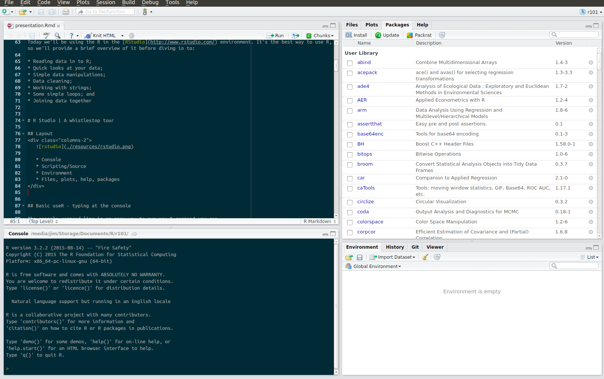

# Introduction

## Background

R is a widely used, open source language for data analysis. 

<br>

It can be easily incorporated into most data-oriented or analytical projects. 

<br>

It can handle pretty much any sort of analysis; the tough thing is often getting your data in to the right shape to do so. 

## Agenda

In today's session we'll discuss:

* An overview of R;
* The steps of an analysis; and
* Challenges, tips, tricks and R packages to overcome them.

## A bit about me

* __Name__: Jim Leach;
* __Course__: MSc. Business Analytics;
* __Occupation__: Data science consultant at KPMG;
* __Contact details__:
    * [leach_jim (twitter)](http://twitter.com/leach_jim)
    * [jim@thedatagent.com](mailto:jim@thedatagent.com)
* __Years using R__: 3.

## Resources:

* __This presentation__ : https://db.tt/1RuSufdb

* __R installation guide__: https://db.tt/4y9HUDFo

* __Oyster data__: https://db.tt/81Xpi0LD

* __Stations data__: https://db.tt/jXj2C4eE

## Why R?

* Free

<br>

* Flexible

<br>

* Powerful

<br>

* Future-resistant

## Why not R?

* There's no (official) support!

<br>

* R can't handle "big" data!

<br>

* But seriously, how ways many are there to do this?!


## Isn't R just for stats?

Simply put: no.

R _does_ have powerful statistical capabilities (more than other [languages](http://stanfordphd.com/Statistical_Software.html))

But it's also [ranked highly](https://www.oreilly.com/ideas/2015-data-science-salary-survey) as an analytics tool. 

It's also the 6^th^ most popular [programming language](http://spectrum.ieee.org/computing/software/the-2015-top-ten-programming-languages) in the world. 

## Checkpoint

To help me get an understanding of your level who has:

1. Programmed in R before?
2. Programmed in _any_ language before?
3. Seen R code before?
4. Used Excel for data analysis?

## R Studio

I recommend using the R in the [RStudio](http://www.rstudio.com/) environment. It's the best way to use R, so we'll do a brief overview now.

<div class="columns-2">
   
   <li> Console </li> <br>
   <li> Scripting/Source </li> <br>
   <li> Environment </li> <br>
   <li> Files, plots, help, packages </li>
</div>

## Tip - Advanced useR - scripting

The scripting environment in R functions just like a code window in any other language.

To create a new script, use Ctrl+Shift+N, click the "new script" icon in the top left corner of R Studio or use File > New File > R Script.

Scripts are recommended as they:

1. Record your steps clearly; and
2. Ensure you can replicate and modify your work easily.

## Packages

R packages are additions to the base R language. They add extra functionality that makes R one of the most flexible languages for data analysis out there - if there's something specific you'd like to do in R, the chances are there's a package for it. 

In these sessions we'll be discussing and using a number of packages that will help us a lot.

## Packages

* [dplyr](http://cran.rstudio.com/web/packages/dplyr/vignettes/introduction.html) - data manipulation
* [tidyr](http://blog.rstudio.org/2014/07/22/introducing-tidyr/) - tidying data
* [lubridate](http://www.r-statistics.com/2012/03/do-more-with-dates-and-times-in-r-with-lubridate-1-1-0/) - working with dates and times;
* [ggplot2](http://ggplot2.org/) - creating static charts;

## Installing packages

Packages are generally hosted on, and installed from CRAN (the R network). Installing packages is easy using this code:

```
install.package("[package name here]")
```

So to install the `dplyr` package we would use the code:

```{r eval = FALSE}
install.packages("dplyr")
```

Once you've installed a package you can load it with the library command:

```{r load_pack_eg, eval = TRUE, message = FALSE}
library(dplyr)
```

# A quick aside | Getting help

## *Where* to ask for help

The great thing about an open source language is its community. Luckily, 
R is no exception and there are a wealth of options for getting help:

1. R help files: `?mean`, `?install.packages`
2. R package vignettes - can see those available with `vignette()`
3. [Google!](https://www.google.co.uk/#safe=off&q=r+help) - but seriously this solves 
 >99% of problems
4. [StackOverflow](http://stackoverflow.com/questions/tagged/r)
5. [Jim Leach](mailto:jim@thedatagent.com)
6. [R mailing list](http://www.r-project.org/mail.html)

## *How* to ask for help

1. Be explicit
2. Describe the goal 
3. Provide reproducible examples 
4. Provide your hardware/software set up.

# Getting Sta-R-ted

## Analytical steps

Data analyses typically follow a number of steps which are broadly the same each time:

1. Get the data
2. Load the data and get an overview
3. Transform the data
4. Perform your analysis
5. Visualise your results
6. Communicate your results

R is useful at _all_ of these stages.

# Step 1 | Get the data

## Data sources

Data come from everywhere: people, programs, physical objects. 

Data are stored everywhere, physically, electronically, in "the cloud". 

Luckily for me, my (Oyster) data came from TfL as a neat(ish) csv file. The rest came from the web.

## What is a .csv

A _.csv_ file is a "comma-separated-values" file. 

It's a way to store data in a text file in a structured way that most spreadsheet/database/analysis programs understand.

It looks a bit like this in its raw form:

```
Date,Start.Time,End.Time,Journey.Action,Charge,Credit,Balance,Note
13-Feb-2015,21:43,22:12,South Kensington to Richmond,0,NA,5.1,NA
13-Feb-2015,18:18,18:47,Canary Wharf [London Underground] to South Kensington,0,NA,5.1,NA
```

## Other data

Some of the data I was interested in using, though, came from the web.

I wanted to get the coordinates of all London stations so that I could map out my transport patterns. 

Let's have a look at that now.

* [Stations](http://en.wikipedia.org/wiki/List_of_London_railway_stations); and
* [Underground stations](http://en.wikipedia.org/wiki/Baker_Street_tube_station)

# Step 2 | Load the data

## Reading from .csv

Loading data from CSV is usually the quickest and easiest method to get data in to R. 

The `read.csv` function makes this really easy.

```{r readCSV, eval=FALSE}
data <- read.csv("[some data].csv", header = TRUE, stringsAsFactors = FALSE)
```

The data will be stored in a `data.frame`, an R data structure that is similar to a SQL or Excel table.

## Reading from the web

Reading/scraping data from the web can be tricky, but the `rvest` R package helps a lot. 

The steps you need to take are:

1. Find the website you're interested in;
2. Use a tool/view the page structure to find out _exactly_ what you're interested in; and
3. Write some code to access that page and grab what you're interested in.

I won't go in to detail today, but I wrote a post about doing that on my blog [here](http://www.thedatagent.com/tflapppart1/).

## Reading data from anywhere

One of the benefits of R is that is can read pretty much any data source you name using a variety of packages:

* Other software (e.g. Stata/SPSS/SAS) - `foreign`
* SQL databases - `RPostgreSQL`, `RODBC`, `RMySQL`, `RSQLite`
* Web API or raw webpages - `xml2`, `rjson`, `jsonlite`, `rvest` 
* Hadoop ecosystem data - `rmr`, `rhdfs`, `SparkR`
* pdf and Word documents - `tm`, `quanteda`

If you ever need to read data in one of these formats and you don't know how, the best way to find the answer is to Google:

"R package read [data source here] data"

## Looking at your data 

```{r get_oyster, echo = TRUE}
oyster <- read.csv("./data/oyster_all_raw_20160125.csv", 
                   header = TRUE, 
                   stringsAsFactors = FALSE)
```

The first thing most of us want to do with our data is to look at it. In R Studio we can accomplish this in a few ways.

1. Click on the data frame in your Environment window - this will open up the data viewer.
2. Using the `View()` command from the script or the command line - this will also open the viewer
3. Use the `head([data], [rows])` command - this will print the first few lines of the data to the console.

## A quick look at the data

The Oyster data look something like this:

```{r show_oyster, echo = FALSE, message = FALSE}
library(knitr)
kable(oyster %>% head(4))
```

## Tip - make it easier to type

Capitalisation will slow you down. 

There's an easy way around that though - force everything to one case. Lower is preferred (as most of `R` is written in lower case).

```{r makeNamesLower}
names(oyster) <- tolower(names(oyster))
```

## Sizing your data

It can often be useful to understand the _dimensions_ of the data you're working with.

In R this is easily accomplished with a couple of commands:

```{r show_sizes, eval = FALSE}
# Overall dimensions
dim(oyster)

# Number of columns
ncol(oyster)

# Number of rows
nrow(oyster)
```

## Checks and Summaries

There are two incredibly useful commands in R for getting a quick overview of your data. These are both great ways to spot and then fix things that might slow you down later.

* `str`: prints an overview of your data, including dimensions and data type (class) of each column.
```{r str, eval=FALSE}
str(oyster)
```
* `summary`: presents a summary of each column, depending on the class of data within it. 
```{r summary,eval=FALSE}
summary(oyster)
```

## Selecting data

In `R` there a couple of simple ways to grab a subset of your data.

If you want to grab a single column from a table, you can use the `$` operator:

```{r dollar_eg, eval = FALSE}
# Select all the dates
oyster$date
```

Or you can use the `data[row(s) , column(s)]` style syntax:

```{r brack_eg, eval = FALSE}
# Get the first 1 rows
oyster[1:10, ]

# Get just the first 3 columns
oyster[ , 1:3]
```

## Other summaries

There are a range of other summary functions that we can apply to our data. Here are a few examples:

```{r summaries,eval=FALSE}
min(data$field)    # Gives the minimum
mean(data$field)   # Gives the mean
max(data$field)    # Gives the maximum
range(data$field)  # Gives the min and max
unique(data$field) # Gives unique values - similar to SQL "DISTINCT"
table(data$field)  # Gives a frequency table
```

Most common descriptive statistics have their own similar function(s), it's just a matter of experimenting or Google-ing to find the one you're looking for.

## Challenge - missing values

All languages handle missing values differently. In `R`, missing values are generally represented as `NA`. 

If we run summaries on data containing `NA` then we get an answer of `NA`, e.g.
```{r NAeg}
mean(oyster$charge)
```

We can get around this by adding `na.rm` as an argument to the function:
```{r NAeg2}
mean(oyster$charge, na.rm = T)
```

# Step 3 | Transform the data

## Oyster data

```{r show_oyster2, echo = FALSE, message = FALSE}
kable(oyster %>% head(4))
```

## Stations data

```{r show_stations, echo = FALSE, message = FALSE}
stations <- read.csv("./data/stations.csv", stringsAsFactors = FALSE) 
stations %>% head(5) %>% kable()
```

## Tip - diagnose the data

After you've got the data loaded and have taken an overview, it can be really valuable to take a moment to diagnose the data.

Firstly, decide on what looks interesting, and what doesn't. These might change over time, but it's good to have a starting point for your analysis.

Then look at what are the problems with the data? What steps will you need to take to transform what you have into something different? What do you need to modify, or derive from fresh?

## Data diagnosis

There were a few things that interested me at first glance, and one that looked boring, namely:

* Times - how long did I spend on public transport?

* Charge - what were my expensive journeys, could I cut my costs?

* What does my travel look like mapped out?

* Note - mostly dull text with little to no value for me.

## Data diagnosis

There are a number of problems with these data - can anyone think of any?

>- Useless dates and times

>- `journey.action` not `to` and `from`

>- Station names don't match in Oyster and station data

>- Charge is usally 0

## Making the transformations

Once you decided what transformations you want, the next step is to do them! 

There are a few packages that made this really easy for me, and are widely used:

* `dplyr`;
* `tidyr`; 
* `stringr`; and
* `lubridate`.

I won't be covering a detailed overview of these packages today, but if you're interested in learning more, get in touch with either [me](mailto:jim@thedatagent.com) or the [Imperial College Data Science Society](https://www.facebook.com/icdatascience/) who can help set up more detailed sessions.

## Pro-tip - add data, don't change data

<blockquote>
<p><b>"Space is cheap, confusion is expensive."</b></p>
<footer>
— <cite><a href="https://guerrilla-analytics.net/the-principles/">Guerialla Analytics Principle 1, Enda Ridge</a></cite>
</footer>
</blockquote>
<br>
When making transformations, try to _add_ new fields to your data, don't change existing ones. 

This makes it easier to have a trail of what has happened to the data, and avoids losing track of what is raw data, and what is transformed data. 

## dplyr - Adding variables

With dplyr we can add variables to a data set using the `mutate` function.

```{r dplyrMutate, eval=FALSE}
mutate([data], [some_new_field]) # general form
mutate(oyster, newField = 4) # set up a new field with the value 4 (always) - useless
```

We can also use simple functions to do calculations.

```{r dplyrMutateCalc,eval=FALSE}
# add charge to balance
mutate(oyster, cost_plus_bal = sum(charge, balance, na.rm = TRUE))
```

## dplyr - Adding variables

Now we've seen how 'mutate' works, we can use it to clean up our data a bit. We wanted to:

* clean up the dates and times in the data;
* separate `journey.action` into `to` and `from`; then
* clean up the station names a bit.

## Cleaning up dates and times

The `lubridate` package makes working with dates and times really easy in R. We can easily convert the text date into an actual date, and the same with the times:

```{r lubridate_eg, eval = TRUE, message = FALSE, warning = FALSE}
library(lubridate)
oyster <- mutate(oyster, 
                 date.clean = dmy(date), # dmy = day, month, year
                 start.time.clean = hm(start.time), # hm = hour, minute
                 end.time.clean = hm(end.time))
```
                        
Here we've used some handy `lubridate` functions that take text data and convert it into dates and times for us easily.

## Making a datetime

Dates and times are all well and good, but a _datetime_ variable might be more useful.

Before we do that, we'll need to combine our dates and times together. We can use the `paste` command to join text data together)
    
```{r add_date_times_text}
oyster <- mutate(oyster, 
                 start.datetime = paste(date, start.time, sep = " "),
                 end.datetime = paste(date, end.time, sep = " "))
```

And then use `lubridate` to turn these into actual _datetime_ variables. This also shows how `mutate` can _modify_ existing fields.

```{r add_date_times, warning = FALSE, eval = TRUE}
oyster <- mutate(oyster,
                 start.datetime = dmy_hm(start.datetime),
                 end.datetime = dmy_hm(end.datetime))
```

## An aside - the correct way to write a date {.flexbox .vcenter}


    
It's simple: __YYYY-MM-DD__

## Date manipulation

There is one final thing that will help address the interest in time on transport: a journey time!
  
```{r add_journey_time, eval = TRUE}
oyster <- mutate(oyster,
                 journey.time = difftime(end.datetime, 
                                         start.datetime, 
                                         units = "mins"))
```

## Splitting up fields

The `tidyr` package is really useful for tidying data. Let's see how we can use it to `separate` out the journey in to `from` and `to` stations.

```{r separate_to_from, warning = FALSE, message = FALSE, eval = TRUE}
library(tidyr)
# separate([data], [column to separate], [names of new columns], [how to split])
oyster <- separate(oyster,
                   col = journey.action, 
                   into = c("from", "to"), 
                   sep = " to ", 
                   remove = FALSE)
```

## Cleaning up station names

To clean up the station names, and enable us to join the Oyster data with the stations data, we can use some text manipulation to remove things we don't want.

There are other patterns in other station names that we might want to remove, e.g. "[London Underground]", "[Dlr]", or "(National Rail)".

To find these patterns we can use a _regular expression_ - a simple way of expressing a pattern to search for:

```{r build_cleaning_regex}
regex <- "\\[.*\\]|\\(.*\\)"
```

## Cleaning up the station names

We can use `gsub` and what we know from `dplyr` to clean up the station names in the Oyster data.

We can use this with the `gsub` command, which will search for and replace a pattern in text.

```{r gsub_eg, eval=FALSE}
gsub([pattern], [replacement], [where to look for the pattern])
```

```{r oyster_clean_stations, eval = TRUE}
library(stringr)
oyster <- mutate(oyster,
                 from.clean = str_trim(gsub(regex, "", from)),
                  to.clean = str_trim(gsub(regex, "", to)))
```

Note the `str_trim` function. It's from the `stringr` package and just trims excess white-space from the start and end of a string.

## Combining data

Now that are data are a bit cleaner, we can combine them with the stations data to get the coordinates of all the stations in preparation for mapping them out.

For this we'll need to do a _join_.

## The basics of joining data together

Join tables of data together requires them to share some data in common. 

This is usually a column appears in both tables that can be used to link them together. 

These columns are referred to as join _keys_.

In order for a join to work properly, the join keys must be exactly the same. 

There is some excellent reference material to help you understand joins which you can check [here](http://r4ds.had.co.nz/relational-data.html).

## Performing the join

We are now ready to join our data sets together. 

```{r lj_1, eval = TRUE}
oyster <- left_join(oyster , stations, by = c("from.clean" = "station"))
oyster <- rename(oyster, 
                 from.long = long,
                 from.lat = lat)
```

But we've got two stations to join, so we'll have to do it twice.

```{r lj_2, eval = TRUE}
oyster <- left_join(oyster, stations, by = c("to.clean" = "station"))
oyster <- rename(oyster,
                 to.long = long,
                 to.lat = lat)
```

The `rename` function is also from `dplyr` and renames columns.

# Step 4 | Perform your analysis

## Tip - remember your questions

Once you've done the hard work of transforming the data, it's on to the analysis. 

After dealing with the detail of the data, it's worth taking a step back to review exactly _why_ you did it.

What were you interested in at the beginning, and what analyses will deal with those interests? 

What have you seen in your intermediate steps that looks interesting, what might you add to your analysis?

Explore new options, but try not to lose sight of what you set out to do in the first place. 

## Journey times

`dplyr` is great for performing summaries and simple analyses, such as looking at just how much time I waste travelling across London:
```{r jim_jt_show, eval = FALSE}
oyster_summary <- group_by(oyster, journey.action)
oyster_summary <- summarise(oyster_summary, trips = n(),
                            avg_time = mean(as.numeric(journey.time)) 
oyster_summary <- arrange(oyster_summary, desc(trips))
```

```{r jim_journey_time_show, eval=TRUE, echo = FALSE}
oyster %>% 
group_by(journey.action) %>% 
summarise(trips = n(),
          avg_time = mean(as.numeric(journey.time), na.rm = TRUE)) %>% 
ungroup() %>% # ungroup removes the grouping and lets us sort the data
arrange(-trips) %>% 
head(3) %>% 
kable(col.names = c("Journey", "Trips", "Average time"))
```

## Develop new questions

After spending time with the data, and answering your initial questions, its time to probe further based on what you've seen, and what you know.

This might mean dropping the analysis all together if your initial results were (in)conclusive. Or it may mean building more sophisticated and complex models to help answer deeper questions.

For example, we might be interested in understanding the network structure of all my journeys.

For us, for now, this will do, and we'll move on to...

# Step 5 | Visualise

## Tip - know the right way to display your data

Knowing how to make a pretty chart is one thing, but knowing _which_ pretty chart to make is another.

An essential skill in visualisation is picking the appropriate chart type for your data, and for your audience.

Complex visuals may show your answer, but if they baffle the viewer, or take too much time to understand, then it's worth moving to something simpler, or adding pointers on how to read your chart.

## A grammar of graphics

In R there are several ways to make graphs.

The most important is `ggplot2`, a _fantastic_ package for making charts based on a booked called the _Grammar of Graphics_ by Leland Wilkinson.

`ggplot2` is incredibly good at what it does and inspires a great deal of enthusiasm from its users.

## ggplot2 {.flexbox .vcenter}

<blockquote>
<p><b>“The emphasis in ggplot2 is reducing the amount of thinking time by making it easier to go from the plot in your brain to the plot on the page.”</b></p>
<footer>
— <cite>Hadley Wickham</cite>
</footer>
</blockquote>


## ggplot2

Let's take a look at some example charts made using ggplot2 that visualise some facets of this data.

They're online [here](https://jleach.shinyapps.io/oyster/).

## Networks

We can also perform some analysis with visualisations, too. 

For example, we can think of the journeys as a network, and chart that out using the `networkD3` package in R.

## Networks {.flexbox .vcenter}

```{r networkD3, echo = FALSE, message = FALSE}
library(networkD3)
library(igraph)
graph <- oyster %>% 
  group_by(from.clean, to.clean) %>% 
  summarise(weight = n()) %>% 
  filter(from.clean != "") %>% 
  filter(to.clean != "") %>% 
  graph_from_data_frame()

nw <- networkD3::igraph_to_networkD3(graph, group = rep(1, length(V(graph))))

# Weight links by number of gifts sent
nw$links$value <- 1

forceNetwork(Links = nw$links,
             Nodes = nw$nodes,
             colourScale = JS("d3.scale.category20()"),
             Source = "source",
             Target = "target",
             Value = "value",
             NodeID = "name",
             Group = "group",
             charge = -250,
             linkColour = "grey",
             opacity = 1,
             legend = F,
             bounded = F,
             zoom = TRUE,
             height = 550,
             width = 1000)
```

# Step 6 | Communicate your findings

## Critical Communication

Communication of your findings is _critically_ important to be successful with data analysis and data science.

R is a _fantastic_ tool for helping with this, too. Not only does it produce graphs and visuals like the ones we've just seen (and more), but it can also be used to create reports and presentations.

This whole slideshow was created using R and a package called `rmarkdown`. 

It can also be used to make LaTeX, HTML, and MS Word reports, too!

## Creating a report

To create a report in RStudio simply select File > New File > R markdown.

You can then create a custom report, mixing free text, markdown styling, HTML markup and R code to produce beautiful reports.

# Closing R-marks

## Summary

In this session we've gone through a lot. We've covered:

* An introduction to R;
* The steps of a data analysis; and
* Some common challenges and how to overcome them.

Let's just reiterate a few key points.

## Data analysis steps

It's worth remembering the steps of a data analysis. They won't all always be relevant, but this can be a good "checklist" to follow to make sure you've covered everything.

1. Get the data
2. Load the data
3. Transform the data
4. Analyse the data
5. Visualise the data
6. Communicate the data

## Getting help

As we said at the beginning, there are lots of great sources of help for R problems. The top 3 are probably:
    
1. R help files: `?mean`, `?grep`
2. R package vignettes - can see those available with `vignette()`
3. [Google!](https://www.google.co.uk/#safe=off&q=r+help)
                 
## Asking nicely
                 
If you really have a problem that you can't solve yourself remember to:
             
1. Be explicit
2. Describe the goal of your analysis
3. Provide reproducible examples
4. Provide your hardware/software set up.

## More R-esources

There are loads of great sources of R information out there. Here are just a few:

* [CRAN](http://cran.r-project.org/doc/manuals/R-intro.pdf)
* [Coursera](https://www.coursera.org/specialization/jhudatascience/1?utm_medium=listingPage)
* [DataCamp](https://www.datacamp.com/)
* [Books](http://www.burns-stat.com/documents/tutorials/impatient-r/)
* [More books](http://www.burns-stat.com/documents/books/the-r-inferno/)
* [Even more books](http://adv-r.had.co.nz/)
* [R-Bloggers](http://www.r-bloggers.com/)


## Even more R-esources

Here's another short list of great resources for reading about R.

* [an introduction to dplyr](https://cran.rstudio.com/web/packages/dplyr/vignettes/introduction.html);
* [my blog](http://www.thedatagent.com);
* [twitter](https://twitter.com/hashtag/rstats?src=hash);


# Q&A