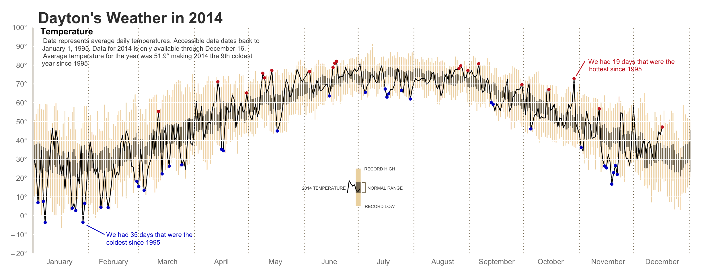
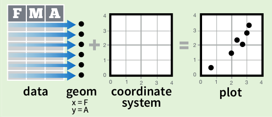
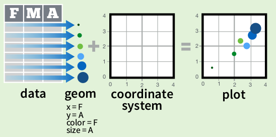
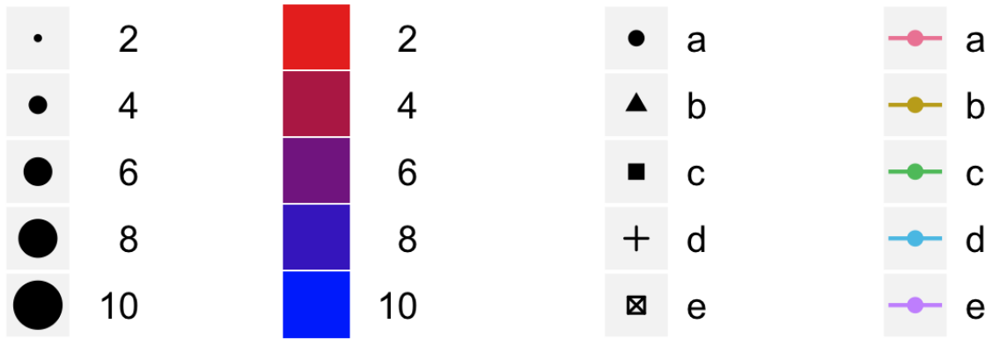

```{r setup, include=FALSE}
knitr::opts_chunk$set(echo = FALSE)
library(ggplot2)
```

# The grammar of graphics

## Why a grammar? {.centered}



<div class="notes">
* Look for 30 seconds. Describe this graph to me in as few words as possible.
    * Is it a line graph? A bar chart? What is it?
* As it was described, would you be able to re-create it?
* Grammar: “the fundamental principles or rules of an art or science” (OED)
* If we develop a grammar, we could answer these questions (although this chart it slightly complex).
* A grammar provides the ability to understand even complex graphs. It also helps us
to understand which charts are well formed.
    * Good grammar is just the first step to a good sentence!
    
> This grammar is useful for both the user and the developer of statistical graphics. For
the user, it makes it easier to iteratively update a plot, changing a single feature at a time.
The grammar is also useful because it suggests the high-level aspects of a plot that
can be changed, giving us a framework to think about graphics, and hopefully shortening the dis-
tance from mind to paper. It also encourages the use of graphics customized to a particular
problem rather than relying on generic named graphics.    

</div>

## The basic elements {.build}

There are three basic elements of a plot:



<div class="notes">
What are they?

There are 3 basic elements to a plot:

1. Data: used to make the plot. Typically rows and columns (but not always)
2. Geoms: the visual, geometric objects that are used to represent the data
3. Coordinate system: onto which we place the geoms
    * Typically cartesian for us (XY plane) but could be something more complex
</div>


## Displaying data in a plot

Map variables in the data to the visual properties of the geom: the __aesthetics__.



<div class="notes">
To create a basic plot, we take elements of the data, and _map_ them to aesthetics.

This _translates_ our data into the visual marks present in the data.

It sounds a little obvious at first, but it is important to understand the basic principles at work

Understanding what sorts of data can be mapped to what sorts of aesthetics is crucial for building effective visualisations
</div>

## A simple example

We want a graph of A vs. C, with points representing D, ignoring B.

```{r}
df <- data.frame(A = c(2, 1, 4, 9),
                 B = c(3, 2, 5, 10), 
                 C = c(4, 1, 15, 10),
                 D = c("a", "a", "b", "b"))
knitr::kable(df, align = rep("c", 4))
```

<div class="notes">
What is our data? (Easy)
What is the geom we want?
What are the coordinates? Answer: cartesian (gloss over)

What do we map to what?

At its most basic we need to map:

* A to the x-position aes
* C to the y-position aes
* D to the shape aes
</div>

## A simple example {.centered}

```{r fig.align = 'centre'}
qplot(data = df, x = A, y = C, shape = D, geom = "point", size = I(5))
```

# Layers of visualisation

## Building in layers

* Data

<br>

* Mappings

<br>

* Statistical transformations

<br>

* Geometric objects

<div class="notes">
* Stat. trans may not be necessary

* Together, these four components form a 'layer'

* The simple example graph contains just one layer, but plots can have many layers (e.g. the first example)

* Typically all layers on a plot show different views of the same data, e.g. a scatterplot with a smoother

More detail...
</div>


## Data & mappings

Convert an abstract graphic into a concrete plot.

```{r}
knitr::kable(head(diamonds))
```

<div class="notes">
In the grammar of graphics, data are actually independant of a plot: we can specify all the elements of a plot without any data, and apply this abstract graphic to many data.

The addition of data simply converts this abstract _graphic_ into a concrete _plot_.

We also need to decide which variables to map to which aethetics, e.g. carat to x-pos, price to y-pos, cut to colour.
</div>

## Statistical transformations

Usually perform some form of summarisation of the data.

```{r, fig.align='center', fig.width=10, fig.height=4}
qplot(data = diamonds, x = price, bins = 30, colour = I("white"))
```

<div class="notes">
There are many stats that we can use to transform the data:
* bins (i.e. histogram)
* boxplots
* smoothers

A stat takes data as input and returns data as output. It may create completely transform the data, or just create new variables which themselves can be mapped to aesthetics.
</div>

## Geoms

Control the type of plot created.

```{r, fig.align='center', fig.width=10, fig.height=4, message = F, warning = F, cache=T}
points <- qplot(data = diamonds, x = carat, y = price, geom = "point", colour = cut, alpha = I(0.5))
smoothed <- qplot(data = diamonds, x = carat, y = price, geom = "smooth", colour = cut)
cowplot::plot_grid(points, smoothed, nrow = 2, ncol = 1)
```

<div class="notes">
* Geoms control what sort of plot we see. They are the visual marks that data are represented as in the graphic.
* Geoms are thought of based on their dimensionality, and of the data which they can be applied to:
    * 1d: bars (histograms), densities, bars (for discrete data)
    * 2d: points, smooths, bars/columns, boxplots, lines, maps
* We've just seen a 1-dimensional plot previously (the histogram). Here we have two plots which are identical apart from the geom we specified. They show the _same_ information, but in a different way because we used a different geom.
* Geoms are abstract and can be rendered in different ways. e.g. an interval can be represented as a box, a line, an error bar, ...
* Geoms are mostly general purpose, but some require specific output from a statistic (e.g. a boxplot).
* Every geom has a default statistic, and vice versa (e.g. bins default to bars)
* Not all geoms can display all aesthetics, e.g. point has position, colour, shape, size, whereas bars have position, height, width, fill.
</div>

## Final notes - scales

Scales control the mapping from data to aesthetics.



<div class="notes">
* Because scales control our mapping, we need one scale for each aesthetic used in each layer.
* Scales are common across layers to ensure a consisten mapping from data to aesthetics.
* Here we see examples legends of data mapped to different scales:
    * The left 2 show a continuous variable mapped to size and colour
    * The right 2 show a discrete variable mapped to shape and colour
* Typically scales relate to a single mapping from variable to aesthetic, e.g. X to shape, Y to colour, Z to size
* We use scales to _control_ the mapping and affect our plot.
</div>

## Final notes - position

Tweaking the position of geometric elements changes the message.

```{r fig.align='center', fig.width=10, fig.height=4, warning = F, message = F}
dodged <- ggplot(diamonds) + geom_bar(aes(cut, fill = color), position = "dodge")
stacked <- ggplot(diamonds) + geom_bar(aes(cut, fill = color))
cowplot::plot_grid(stacked, dodged)
```
<div class="notes">
* Position is often used to aid clarity in a plot.
* E.g. a scatter plot with few unique X/Y combinations may be better with jitter
* However it can also change the message of the plot, on the left we see how many total diamonds there are of each cut, on the right this is harder to see
</div>

## Final notes - facets

Create small multiples for different subsets of an entire dataset

```{r fig.align='center', fig.width=10, fig.height=4, warning = F, message = F}
qplot(data = diamonds, geom = "bar", x = cut, fill = color, facets = ~color)
```

# ggplot2 | Implementing the grammar

## Some examples

