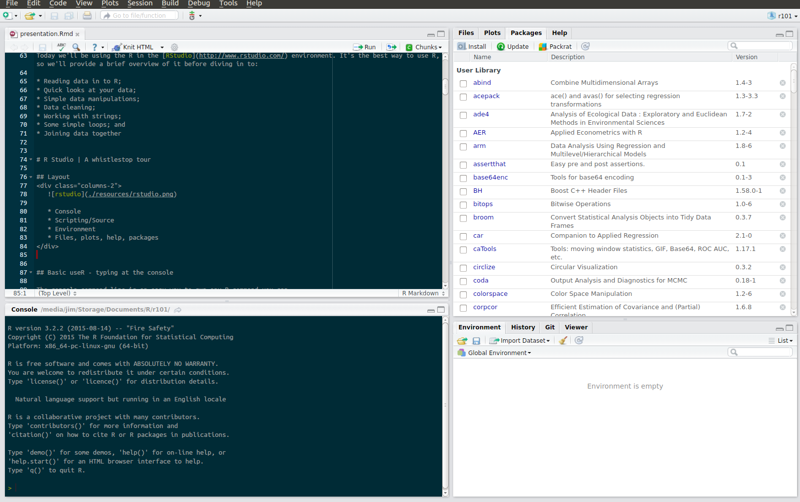

# Introduction

## Background

R is a widely used, open source language. It can be easily incorporated into most data-oriented or analytical projects. It can handle pretty much any sort of analysis, the tough thing is getting your data in to the right shape to do so.

As such, in this session we'll discuss how you can start doing some common data manipulation tasks using R. Whilst this won't make you an R wizard, it should give you some of the basic building blocks for starting to use R more widely.

## Isn't R just for stats?

Simply put: no.

Whilst R does have powerful statistical capabilities (in fact, more than other [languages](http://stanfordphd.com/Statistical_Software.html)) it's also [ranked highly](http://www.oreilly.com/data/free/2014-data-science-salary-survey.csp) (behind only SQL and Excel) as a general analytics tool. 

It's also the 6^th^ most popular [programming language](http://blog.revolutionanalytics.com/2014/07/ieee-ranks-r-9-amongst-all-languages.html) in the world. Not bad.

## Why R?

* Free

<br>

* Flexible

<br>

* Powerful

<br>

* Future-resistant

## Why not R?

* Open source is scary, right?

<br>

* There's no support!

<br>

* R can't handle "big" data!

<br>

* But seriously, how ways many are there to do this?!


## Agenda

Today we'll be using the R in the [RStudio](http://www.rstudio.com/) environment. It's the best way to use R, so we'll provide a brief overview of it before diving in to:

* Reading data in to R;
* Quick looks at your data;
* Simple data manipulations;
* Data cleaning;
* Working with dates;
* Working with strings; and
* Joining data together


## R Studio | A whistlestop tour
<div class="columns-2">
   

   * Console
   * Scripting/Source
   * Environment
   * Files, plots, help, packages
</div>

## Advanced useR - scripting

The scripting environment in R functions just like a code window in any other language.

To create a new script, use Ctrl+Shift+N, click the "new script" icon in the top left corner of R Studio or use File > New File > RScript.

Scripts are recommended as they:

1. Record your steps clearly; and
2. Ensure you can replicate and modify your work easily.

To run any commands from the scripting window, highlight them and use 
Ctrl+Enter or click "Run" in the top right of the scripting area. This 
is the equivalent of typing them in to the console.


## The bits that aren't for typing

* __Environment__ - shows all objects (i.e. data) currently loaded in 
to R. More on this later.
* __History__ - a list of recently executed R commands.
* __Files__ - operates as a file browser, helping you navigate around your file system.
* __Plots__ - displays any plots you've made from an R script or from the console.
* __Packages__ - lists all the packages you've got installed/loaded. 
* __Help__ - Displays information on all R functions, the options for each one and examples of their usage.

## Projects

RStudio projects are a great way to organise your work and keep things together. 

They can be created easily by clicking the drop down in the top right of your RStudio window and selecting "New project". You can choose to associate one with an existing folder/directory, or make one somewhere new.

When you shut a project, anything you were working on will get re-opened the next time you shut a project, and your working directory will automatically get set to wherever the project is saved.

## Packages

R packages are additions to the base R language. They add extra functionality that makes R one of the most flexible languages for data analysis out there - if there's something specific you'd like to do in R, the chances are there's a package for it. 

Today we'll be discussing and using a number of packages that will help us get started with R.

## Packages

* [readr](https://github.com/hadley/readr) - reading and writing data
* [dplyr](http://cran.rstudio.com/web/packages/dplyr/vignettes/introduction.html) - data manipulation
* [magrittr](http://cran.r-project.org/web/packages/magrittr/vignettes/magrittr.html) - data pipelines
* [readxl](http://blog.rstudio.org/2015/04/15/readxl-0-1-0/) - reading data from Excel
* [tidyr](http://blog.rstudio.org/2014/07/22/introducing-tidyr/) - tidying data
* [lubridate](http://www.r-statistics.com/2012/03/do-more-with-dates-and-times-in-r-with-lubridate-1-1-0/) - working with dates and times

```{r load_packages, echo=FALSE, message=FALSE, warning=FALSE}
library(dplyr)
library(magrittr)
library(readxl)
library(tidyr)
library(lubridate)
```

All of these packages were (co)created by [Hadley Wickham](http://had.co.nz/). His work is so prolific and popular that his approach to data analysis is known as the "hadleyverse" in the R community. He's also writing the most comprehensive [book](http://adv-r.had.co.nz/) on R out there.

Note that are many alternatives to the "Hadley" way of doing things, but for beginners his methods are often easiest to get to grips with.

# A quick aside | Getting help

## *Where* to ask for help

The great thing about an open source language is its community. Luckily, 
R is no exception and there are a wealth of options for getting help:

1. R help files: `?mean`, `?iris`
2. R package vignettes - can see those available with `vignette()`
3. [Google!](http://lmgtfy.com/?q=R+help) - but seriously this solves 
 >99% of problems
4. [StackOverflow](http://stackoverflow.com/questions/tagged/r)
5. [Jim Leach](mailto:jim@thedatagent.com)
6. [R mailing list](http://www.r-project.org/mail.html)

## *How* to ask for help

If you really have a problem that you can't solve with Google you may 
want to post to Stack Overflow, the R mailing list or similar. If you 
do, remember to:

1. Be explicit - state your problem in detail.
2. Describe the goal of your analysis - not the programming steps you're taking.
3. Provide reproducible examples - simulate the data if needs be.
4. Provide your hardware/software set up.

# Getting Sta-R-ted | Loading data

## Data structures

There are a range of different objects in R that hold some form of data. The most common are:

* __Vectors__ - a sequence of values that have the same data type (e.g. all numbers or all letters). 
* __Lists__ - similar to vectors but can have different data types (e.g. a mix of numbers of characters).

Think of these two as a bit like a single column in SQL/Excel.

* __Matrices__ - a table of values where all fields have the same data type.
* __Data frames__ - a table of values with different data types in each field.

These latter two can be though of as SQL/Excel tables/datasets.

## Quick tip - assignment in R

In R you should use the `<-` symbol to assign a value or some data to an R object:

```{r assingmenteg1, eval=FALSE}
a <- 10
```

(Pretty much) anything can be assigned to   an R object - including an entire data set.

```{r assingmenteg2, eval=FALSE}
data  <- SomeDataFromSomewhere
```

## Reading from .csv

Loading data from CSV is usually the quickest and easiest method to get data in to R. To do it we use the 'read.csv' command. This takes the form `read.csv("path/to/the/data",...)`. 

`...` indicates other options we might want to specify.

Let's look at that now.

```{r readCSV, eval=FALSE}
data <- read.csv("[some data].csv", header = TRUE, stringsAsFactors = FALSE)
```

Generally, `read.csv` only needs you to specify the file path, the other options (e.g. header row true/false) are taken care of for you.

Try reading the `oyster_all_raw_20151113.csv` data file in to R.

## Reading from other flat file sources

`read.csv` is a hugely useful function if we have `.csv` files. But what if we've got a tab-delimited file or some other flat file source?

Checking the help file with `?read.csv` shows us how we might solve this problem. The general way to read flat files is with:

```{r readTable, eval=FALSE}
data <- read.table("path/to/file",...)
```

There's a lot of options we can set. This means we can flexibly load pretty much any text or flat file source, as long as we know its properties. 

`read.csv` is a _wrapper_ for `read.table` - it sets a lot of these options for us so we don't have to worry. The help file lists a number of other wrappers that set different options. 

## Reading from Excel

Excel is notorious for making importing data a nightmare. It's no different with R. We advise that you save your Excel file(s) as .csv files before importing in to R. 

However if you *have* to import from Excel, we recommend using the `readxl` package:
```{r readExcel, eval=FALSE}
library(readxl)
data <- read_excel("path/to/excel/file", sheet = "[the sheet you want]", col_names = T)
```

If we look at the help file with `?read_excel` we see that there are lots of options we can set, including reading in a specific named sheet, setting a start row and specifying the type data in each column.

## Reading from anywhere

One of the benefits of R is that is can read pretty much any data source you name using a variety of packages:

* Other software (e.g. Stata/SPSS/SAS) - `foreign`
* SQL databases - `RPostgreSQL`, `RODBC`, `RMySQL`, `RSQLite`
* Web API or raw webpages - `xml2`, `rjson`, `jsonlite`, `rvest` 
* Hadoop ecosystem data - `rmr`, `rhdfs`, `SparkR`
* pdf and Word documents - `tm`

If you ever need to read data in one of these formats and you don't know how, the best way to find the answer is to Google:

"R package read [data source here] data"

## Writing data with R

It's easy to write out to csv or other flat file sources, too.

```{r writeFlat, eval=FALSE}
write.table(data, file = "./outputs/file.txt", sep = "|", row.names = FALSE)
write.csv(data, file = "./outputs/file.csv", row.name = FALSE)
```

Writing to Excel requires the `xlsx` package:
```{r write_excl, eval=FALSE}
library(xlsx)
write.xlsx(data, file = "/path/to/file.xlsx")
```


## Final note - data types in R

R stores data as one of the following types (similar to data types in a SQL database):

* _Numeric_ - numbers with decimal points
* _Integer_ - whole numbers
* _Logical_ - boolean True/False
* _Factors_ - categorical data, with each category stored as a numerical level "under the bonnet". Factors can be ordered ("Ordinal") or un-ordered ("Nominal").
* _Character_ - strings

Your code will behave differently depending on the data type.

# Moving Fu-R-ther | Checking and exploring data

## Looking at your data

```{r get_oyster, echo = TRUE}
oyster <- read.csv("./data/oyster_all_raw_20151113.csv")
```

The first thing most of us want to do with our data is to look at it. In R Studio we can accomplish this in a few ways.

1. Click on the data frame in your Environment window - this will open up the data viewer.
2. Using the `View()` command from the script or the command line - this will also open the viewer
3. Use the `head([data], [rows])` command - this will print the first few lines of the data to the console.

Try this now.

## A quick look at the data

The Oyster data look something like this:

```{r show_oyster, echo = FALSE}
library(knitr)
oyster %>% head(4) %>% kable()
```

## A quick look at the data (2)

The stations data look like something like this:

```{r show_stations, echo = FALSE}
library(knitr)
read.csv("./data/stations.csv") %>% 
    filter(station %in% c("Richmond", "Canary Wharf", "South Kensington", "Bank",
                          "Whitechapel", "Algate East")) %>% 
    head(6) %>% kable()
```

## Because no one likes typos - make it easier to type

It sounds silly, but capitalisation in column names will slow you down. Luckily, there's an easy way around that - force everything to either upper or lower case. Lower is prefered (as most of `R` is written in lower case) .

```{r makeNamesLower}
names(oyster) <- tolower(names(oyster))
```

## Checks and Summaries

There are two incredibly useful commands in R for getting a quick overview of your data.

* `str`: prints an overview of your data, including dimensions and data type (class) of each column.
```{r str, eval=FALSE}
str(oyster)
```
* `summary`: presents a summary of each column, depending on the class of data within it. 
```{r summary,eval=FALSE}
summary(oyster)
```
These are both great ways to spot and then fix things that might slow you down later, such as numeric data being treated as a character, or unexpected extreme values. Try them now.

## Fixing problems - changing data types

If we want to change the data type of a specific field, we can use a variety of `as.[data_type]` functions to *coerce* data to the type we want it. 

This is when we force a field to be a specific data type; similar to using `CAST()` or `CONVERT()`.

We know how to select a single column with `$`, so let's look at how we change the data type:
```{r as.,eval=FALSE}
as.character(oyster$credit) # Forces the values to be characters
as.numeric(oyster$credit)    # Forces the values to be numbers
```

*** 

We can combine selection and coercion with the assignment operator `<-` to "fix" data in our table:
```{r as.<-,eval=FALSE}
oyster$credit <- as.character(oyster$credit) # Change the length to text
str(oyster)    # Check what we've done
oyster$credit <- as.numeric(oyster$credit) # Change it back
```

## Other summaries

There are a range of other summaries we can compute on our data. Here are a few examples:

```{r summaries,eval=FALSE}

min(data$field)    # Gives the minimum
mean(data$field)   # Gives the mean
max(data$field)    # Gives the maximum
range(data$field)  # Gives the min and max
unique(data$field) # Gives unique values - similar to SQL "DISTINCT"
table(data$field)  # Gives a frequency table
```

Most common descriptive statistics have their own similar function(s), it's just a matter of experimenting or Google-ing to find the one you're looking for.

## Final note - missing values

All languages handle missing values differently. In R, missing values are generally represented as `NA`. 

If we run summaries on data containing `NA` then we get an answer of `NA`, e.g.
```{r NAeg}
x <- c(1, 2, 3, 4, 5, NA)
mean(x)
```

We can get around this by adding the `na.rm` argument to the function:
```{r NAeg2}
mean(x, na.rm = T)
```

## A quick look at the data - again

```{r show_oyster2, echo = FALSE}
library(knitr)
oyster %>% tail(5, addrownums = FALSE) %>% kable()
```

## A quick look at the data (2) - again

```{r show_stations2, echo = FALSE}
library(knitr)
read.csv("./data/stations.csv") %>% 
    filter(station %in% c("Richmond", "Canary Wharf", "South Kensington", "Bank",
                          "Whitechapel", "Algate East")) %>% 
    head(6) %>% kable()
```

## Some questions to ask of the data

Now we've seen the data, we can start to come up with some exploratory questions we might ask:

* What are the top 5 journeys?
* What was the longest journey, how long was it, and when was it?
* What is the average journey time for each day of the week?
* What is the average number of journeys per day of the week?
* Where does Jim live, and what are the coordinates of the station?

Given what we have seen in the data, and what we know about how it is stored and structured, what might we need to do to address these questions?

# Digging Deepe-R | Manipulating and aggregating data

## Pro-tip - piping your operations

Before we get in to the details of data manipulation and aggregation, there's an important point we'd like to make about a fantastic new feature in R: the `%>%` pipe.

Taken from the [magrittr](http://cran.r-project.org/web/packages/magrittr/vignettes/magrittr.html) package and popularised in [dplyr](http://cran.rstudio.com/web/packages/dplyr/vignettes/introduction.html), you can read the `%>%` pipe as "then". e.g., the code:
```{r pipe, eval=FALSE}
library(magrittr)
some_data %>% some_function
```
can be read as "take some_data, __then__ perform some function on it".

To get specific, the left hand side of `%>%` is *piped* into the first argument of the function on the right hand side. There are a few restrictions on exactly what you can *pipe* in to what, but for our purposes this is a good rule of thumb.

## dplyr - A very brief introduction

The `dplyr` package is a new(ish) package that aims to make data manipulation easier, more consistent and faster.

It is focussed exclusively on data frames and works very well with the pipe paradigm.

It uses a small number of easy to learn functions ("verbs") for the vast majority of operations.

Generally each function takes a data frame as its first argument, and returns a data frame back to you.

## dplyr - Selecting and dropping variables

The simplest dplyr "verb" is `select`, used to select columns in a data frame.

```{r dplyrSelect, eval=FALSE}
select([data], [fields to select]) # The general form of the function
oyster %>% select(Date, journey.action, charge) # Select just date, journey and charge
oyster %>% select(1, 2, 3) # We can also use column positions to select
oyster %>% select(1:3, 5, 7)
```

We can combine also use "negative selection" to drop variables we don't want any more
```{r dplyrDrop, eval=FALSE}
oyster %>% select(-journey.action, -charge)
oyster %>% select(-c(4, 6, 7))
```

This can be used to just grab what is needed, or to reorder columns in the data.

## dplyr - Filtering

The second verb is `filter`. You can think of `filter` as a `WHERE` clause - it subsets by rows (whereas `select` subsets by columns):
```{r dplyrFilter, eval=FALSE}
filter([data], [filter conditions]) # the general form of the function

oyster %>% filter(charge != 0) # Numeric condition

oyster %>% filter(note != "") # Text condition
```

To combine multiple filters use `&` for `AND` and `|` for `OR`.

```{r dplyrFilterAssign, eval = FALSE}
whoops <- oyster %>% filter(balance < 0) # filtering with assignment
noteworthy <- oyster %>% filter(note != "" & charge >= 2) # multiple conditions
```

## dplyr - Filtering

Pretty much any logical test can be used with `filter`, including:

* `>` greater than
* `<` less than
* `==` equal to
* `>=` greater than or equal to
* `<=` less than or equal to
* `%in%` - similar to `IN` in SQL
* `between`

## dplyr - Simple aggregations

The `summarise` verb is a powerful way to compute summaries over the data:
```{r dplyrSummarise, eval=FALSE}
summarise([data], [new_field] = some_function([existing_field])) # the general function

oyster %>% summarise(avg_charge = mean(charge, na.rm = TRUE)) # average charge
```

Note that multiple summaries using multiple functions within `summarise`, they just need to be separated by a comma:

```{r dplyrSummarise2, eval = FALSE}
oyster %>% summarise(avg_charge = mean(charge, na.rm = TRUE), # average charge
                     sd_charge = sd(charge, na.rm = TRUE)) # charge std. deviation
```

Most functions can be applied within summarise (including bespoke ones!). However, we're probably more interested in grouping our data first.

## dplyr - Aggregating by groups

Similar to SQL, dplyr has a `group_by` verb that we can add to the chain of commands. However, note that the order is different to standard SQL: we need to group before we summarise.

(Note that `%>%` pipes flow over multiple lines.)

```{r dplyrGroup, eval=FALSE}
group_by([data], [field_to_group_by_1], [field_to_group_by_2]) # general form

oyster %>% group_by(journey.action) # this doesn't tell us much - add a summary!

oyster %>% 
    group_by(journey.action) %>% 
    summarise(avg_cost = mean(charge, na.rm = TRUE)) # more interesting
```

## dplyr - Arranging data

Finally, something that is often useful is the `arragne` verb, which acts as the `ORDER BY`.

```{r dplyrArrange, eval = FALSE}
arrange([data], [fields_to_order_by]) # general form
oyster %>% arrange(date)
```

Similar to `select` it is possible to use a `-` to do reverse ordering:

```{r dplyrArrangeRev, eval = FALSE}
oyster %>% arrange(-charge)
```

And specifiy multiple ordering fields:

```{r dplyrArrangeMult, eval = FALSE}
oyster %>% arrange(journey.action, -charge)
```

## dplyr - Putting it all together

Now we've seen the individual functions, we can use the `%>%` operator to create a whole set of instructions to answer our questions, e.g.

> What are the top 5 journeys?


```{r dplyrChain, eval=TRUE}
oyster_summary <- oyster %>% 
                    group_by(journey.action) %>% 
                    summarise(journeys = n()) %>% 
                    arrange(-journeys) %>% 
                    head(5)
```

## The output

```{r kablechain, echo=FALSE}
oyster_summary %>% kable()

```


## dplyr - So many options!

`dplyr` is a fantastic package that makes data manipulation incredibly easy. We've so far covered some of the most basic but most used functions. For a complete set, along with examples, be sure to check out the [cheatsheet](http://www.rstudio.com/wp-content/uploads/2015/01/data-wrangling-cheatsheet.pdf) the author has released.

Some tasters include:

<div class="columns-2">
   * `distinct`
   * `rename`
   * `lead`
   * `lag`
   * `dense_rank`
   * `row_number`
</div>

# Doing Mo-R-e | Removing mess, adding variables, and further cleaning

## Working with mess

A closer inspection of the data will reveal the presence of fake "journeys" as well as journeys that will not be informative. Some examples include:

* "Topped-up"
* "Season ticket bought"
* "Unspecified location"

This sort of thing is no good, so we'll remove it. 

(Note there are other "bad records" in the data, see if you can find them.)

## Slicing and dicing

`dplyr` also provides a handy verb, `slice` that allows rows to be filtered by index, a bit like using the `data[row, column]` syntax but more useful in pipelines. 

To start with, though, we need the rows that contain the messy data:
```{r getMess, eval = TRUE}
badRecords <- "Topped-up|Season ticket|Unspecified location"

# grep([what to search], [where to search for it])
records <- grep(badRecords, oyster$journey.action) 
```

`grep` is an R function that mimics functionality from the Unix command line, it searches for patterns called __regular expressions__. Don't worry too much about regular expressions for now, they're just a compact way of specifying patterns to search for. We'll see some other examples later.

***

Now that we have our index of bad records, we can use `slice` and `"-"` to get rid of the mess:

```{r dplyrSlice}
# slice([data], [rows to keep or exclude]) the general form
oyster <- oyster %>% slice(-records)
```

Note the use of `-` to do "negative selection" to omit records from the data. This is simlar to using `oyster[, -records]` but fits in to a `dplyr` pipeline.

However, there's still a lot of mess - poorly formatted dates and useless journey strings.

## dplyr - Adding variables

With dplyr we can add variables to a data set using the `mutate` verb.
```{r dplyrMutate, eval=FALSE}
mutate([data], [some_new_field]) # general form
oyster %>%  mutate(newField = 4) # set up a new field with the value 4 (always) - useless
```

We can also use simple functions to do calculations, and specify multiple new fields by separating them with commas.
```{r dplyrMutateCalc,eval=FALSE}
oyster %>% mutate(cost_plus_bal = charge + balance, # add charge to balance
                  cost_plus_bal_clean = sum(charge, balance, na.rm = TRUE)) # clean up
```

Or, use conditions to create variables (similar to a `CASE` statment):
```{r dplyrManipCase, eval=FALSE}
oyster %>% mutate(no_cost = ifelse(charge == 0 | is.na(charge), 1, 0))
```

## dplyr - Adding variables

Now we've seen how 'mutate' works, we can use it to clean up our data a bit. Let's start with the poorly formatted times that we've been provided with.

```{r show_times, echo = FALSE}
oyster %>% select(start.time, end.time) %>% head(3) %>% kable()
```


Looks ok, but not quite what we want. Ideally we'd like `HH:MM:SS` formats.

## dplyr - Adding variables

We can use the 'paste' command to get what we need.

```{r paste_eg, eval = FALSE}
paste(string1, string2, string3, ..., sep = " ") # paste strings together with a space
paste0(string1, string2, string3, ...) # paste things together with no space
```

Combining this with `mutate` it's easy to add cleaned up fields:
```{r oyster_add_clean_times, eval = TRUE}
oyster <- oyster %>% 
            mutate(start.time.clean = start.time %>% paste0(":00"),
                    end.time.clean = end.time %>% paste0(":00"))
```

## tidyr - Splitting fields

We're getting closer to something that's useful, but we still could do with splitting _journey_ into separate "from" and "to" fields. Handily, we can use the `tidyr` package to do this, specifically, the `separate` function:

```{r separate_eg, eval = FALSE}
install.packages("tidyr")
library(tidyr)
separate([data], [column to separate], [new columns], sep = [separator], remove = FALSE)
```

```{r separate_to_from, warning = FALSE, message = FALSE}
oyster <- oyster %>% 
          separate(col = journey.action, 
                   into = c("from", "to"), 
                   sep = " to ", 
                   remove = FALSE)
```

We will need to do some more cleaning to these fields, but for now they suffice.

## lubridate -  Working with dates and times

```{r load_lubridate, eval = FALSE}
install.packages("lubridate")
library(lubridate)
```

Another thing we might want to do is to take what are currently character/string representations of dates and times and turn them in to actual dates and times. 

This can be a bit finnicky in R, so we'll turn to another package, `lubridate` to make things a little easier.

`lubridate` has a whole host of handy functions for operating on dates. We'll see just a few here so be sure to check out a fuller [overview](http://www.r-statistics.com/2012/03/do-more-with-dates-and-times-in-r-with-lubridate-1-1-0/) if you need it.

## lubridate - working with dates

The first thing we might want to do is to change the date to an actual date. `lubridate` provides an easy to remember syntax for this of the form `ymd()` (i.e. _year, month, day_). Changing the order of the `ymd` part will tell `lubridate` that our data is in a different format.

Looking at how we have received the data, it looks like we have a format similar to _day - month - year_. Combinding this with some `dplyr` that we already know we can add a clean date field:

```{r dmy}
oyster <- oyster %>% mutate(date.clean = dmy(date))
```

## An aside - the correct way to write a date {.flexbox .vcenter}


It's simple: __YYYY-MM-DD__

## dplyr - adding date _times_

Dates and times are all well and good, but a _datetime_ variable might be more useful.

Before we do that, we'll need to combine our dates and times together. Again, a bit of `dplyr` and some `paste` will come in handy:

```{r add_date_times_text}
oyster <- oyster %>% 
            mutate(start.datetime = paste(date, start.time.clean, sep = " "),
                    end.datetime = paste(date, end.time.clean, sep = " "))
```

We'll need to turn these in to _datetime_ variables using `lubridate`

## dplyr & lubridate - modifying fields

We've seen `dplyr` mutate being used to _add_ fields to our data, but it can also _modify_ them in place.

Let's combine a `mutate` with some `lubridate` functions to modify our textual datetimes in to actual datetimes:

```{r add_date_times, warning = FALSE}
oyster <- oyster %>% mutate(start.datetime = dmy_hms(start.datetime),
                            end.datetime = dmy_hms(end.datetime))
```


So far so good, there's just one problem. What about dates where we touched in before midnight, but touched out afterwards?

## lubridate - date manipulation

We need to add a day. But we need a way to identify those dates first. We can use the cleaned up times to do this with some simple string matching:

```{r get_after_midnight}
after_midnight <- grep("00|01|02", substring(oyster$end.time.clean, 1, 2)) 
```

And then use `lubridate` to add a day:
```{r add_day}
oyster[after_midnight, "end.datetime"] <- 
    oyster[after_midnight, "end.datetime"] + days(1)
```

Note that dplyr was _not_ used to do the manipulation for us. Sometimes base `R` is a little more compact, but perhaps less readable.

## lubridate - date manipulation

There are a few final things we might like to add to help us answer our questions:

* a journey time:

```{r add_journey_time}
oyster <- oyster %>% mutate(journey.time = difftime(end.datetime, start.datetime, 
                                                    units = "mins"))
```

* a day of the week for each journey:

```{r add_weekdays}
oyster <- oyster %>% mutate(journey.weekday = wday(date.clean, 
                                                   label = TRUE, 
                                                   abbr = FALSE))
```

## Answering the questions

* <del>What are the top 5 journeys?</del>
* __What was the longest journey, how long was it, and when was it?__
* __What is the average journey time for each day of the week?__
* __What is the average number of journeys per day of the week?__
* Where does Jim live, and what are the coordinates of the station?

Try to create the query you would need for each of these.

## Longest journey

```{r longest_journey, eval = FALSE}
oyster %>% 
    filter(journey.time == max(oyster$journey.time, na.rm = TRUE)) %>% 
    select(journey.action, journey.time, date)
```

```{r longest_journey_show, echo = FALSE}
oyster %>% 
    filter(journey.time == max(oyster$journey.time, na.rm = T)) %>% 
    select(journey.action, journey.time, date) %>% 
    kable(col.names = c("Journey", "Duration", "Date"))
```

## Average journey time by day

```{r avg_time_per_day, eval = FALSE}
oyster %>% 
    group_by(journey.weekday) %>% 
    summarise(avg_time = floor(mean(journey.time, na.rm = TRUE)))
```
```{r avg_time_per_day_show, echo = FALSE}
oyster %>% group_by(journey.weekday) %>% 
    summarise(avg_time = floor(mean(journey.time, na.rm = TRUE))) %>%
    filter(journey.weekday != "Sunday" & journey.weekday != "Saturday") %>% 
    kable(col.names = c("Weekday", "Average journey time"))
```

## Average journeys per day
```{r avg_journ_per_day, eval = FALSE}
oyster %>% 
    group_by(date.clean, journey.weekday) %>% summarise(journeys = n()) %>% 
    group_by(journey.weekday) %>% summarise(avg_journeys = mean(journeys))
```
```{r, avg_journ_per_day_show, echo = FALSE}
oyster %>% 
    group_by(date.clean, journey.weekday) %>% 
    summarise(journeys = n()) %>% 
    group_by(journey.weekday) %>% 
    summarise(avg_journeys = mean(journeys)) %>% 
    filter(journey.weekday != "Saturday" & journey.weekday != "Sunday") %>% 
    kable(col.names = c("Weekday", "Average number of journeys"))
```

# R-ounding off | Joins and tidy data

## Where are we?

So far we've looked at some standard data cleaning, manipulation and summarisation. But to get more from our analyses we might want to include _other_ data sources. In this example, we might want the station location data.

```{r get_stations}
stations <- read.csv("./data/stations.csv", stringsAsFactors = FALSE)
```
```{r show_stations_again, echo=FALSE}
stations %>% head(3) %>% kable(col.names = c("Station", "Longitude", "Latitude"))
```

## dplyr - joins

To combine the locations with the Oyster data we'll need a _join_.

`dplyr` has also implemented a great set of `join` operations to facilitate even easier data manipulation directly in R:

```{r dplyrJoins, eval=FALSE}
# Mutating joins - return all relevant rows from both tables
left_join(data1, data2, by = "variable")
right_join(data1, data2, by = "variable")
inner_join(data1, data2, by = "variable")
outer_join(data1, data2, by = "variable")

# Filtering joins - return all relevant rows from the first table
semi_join(data1, data2, by = "variable") # All rows in A that have matches in B
anti_join(data1, data2, by = "varibale") # All rows in A that have no matches in B
```

## Checking our join keys

For a join to work, the data we will use to match records together needs to... match.

### Oyster data

```{r show_oyster_cw, echo = FALSE}
oyster %>% slice(grep("Canary", journey.action)) %>% 
    head(2) %>% select(from, to) %>% 
    kable()
```

***

### Stations data

```{r show_stations_cw, echo = FALSE}
stations %>% slice(grep("Canary", station)) %>% head(2) %>% select(station, long, lat) %>% kable()
```

The join keys are not quite the same, so we'll need to do one last bit of cleaning.

## A return to regular expressions

There are other patterns in other station names that we might want to remove, e.g. "[London Underground]", "[Dlr]", or "(National Rail)".

To find these patterns we can use a _regular expression_ - a simple way of expressing a pattern to search for:

```{r build_cleaning_regex}
regex <- "\\[.*\\]|\\(.*\\)| [Dd][Ll][Rr]"
```

Don't worry about learning regular expressions right away, just know that they can be incredibly useful for all sorts of things.

We can use this with the `gsub` command, which is a bit like `grep` but will replace a pattern if it is found.
```{r gsub_eg, eval=FALSE}
gsub([pattern], [replacement], [where to look for the pattern])
```

## Cleaning up the station names

We can use `gsub` and what we know from `dplyr` to clean up the station names in the Oyster data.

```{r oyster_clean_stations}
library(stringr)
oyster <- oyster %>% 
            mutate(from.clean = str_trim(gsub(regex, "", from)),
                   to.clean = str_trim(gsub(regex, "", to)))
```

Note the `str_trim` function. It's from the `stringr` package and just trims excess whitespace from the  start and end of a string.

## dplyr - Performing the join

We should now be ready to join our data sets together. 

```{r lj_1}
oyster <- oyster %>% 
            left_join(stations, by = c("from.clean" = "station")) %>% 
            rename(from.long = long,
                   from.lat = lat)
```

But we've got two stations to join, so we'll have to do it twice.

```{r lj_2}
oyster <- oyster %>% 
            left_join(stations, by = c("to.clean" = "station")) %>% 
            rename(to.long = long,
                   to.lat = lat)
```

The `rename` function is also from `dplyr` and renames columns using a `new_name = old_name` syntax.

## Answering the last question

We now should have everything we need to answer the last question.

* <del>What are the top 5 journeys?</del>
* <del>What is the average number of journeys per day of the week?</del>
* <del>What is the average journey time for each day of the week?</del>
* <del>What was the longest journey, how long was it, and when was it?</del>
* __Where does Jim live, and what are the coordinates of the station?__

What query should we run?

## Where does Jim live?

```{r jim_live, eval=FALSE}
oyster %>% 
    group_by(from, from.long, from.lat) %>% 
    summarise(visits = n()) %>% 
    ungroup() %>% # ungroup removes the grouping and lets us sort the data
    arrange(-visits)
```
```{r jim_live_show, eval=TRUE, echo = FALSE}
oyster %>% 
    group_by(from.clean, from.long, from.lat) %>% 
    summarise(visits = n()) %>% 
    ungroup() %>% 
    arrange(-visits) %>% 
    head(3) %>% 
    kable(col.names = c("Station", "Longitude", "Latitude", "Visits"))
```

# Closing R-marks

## Summary

In this session we've gone through a brief introduction to data manipulation using R. We've covered:

* Reading data in to R;
* Quick looks at your data;
* Simple data manipulations;
* Data cleaning;
* Working with dates;
* Working with strings; and
* Joining data together

We've also covered the `%>%` piping paradigm which can help to create code that is clearer and easier to read. 

## Getting help - again

As we said at the begining, there are lots of great sources of help for R problems. The top 3 are probably:

1. R help files: `?mean`, `?iris`
2. R package vignettes - can see those available with `vignette()`
3. [Google!](http://lmgtfy.com/?q=R+help)

## Asking nicely

If you really have a problem that you can't solve yourself remember to:

1. Be explicit - state your problem in detail.
2. Describe the goal of your analysis - not the programming steps you're taking.
3. Provide reproducible examples - simulate the data if needs be.
4. Provide your hardware/software set up.

## More R-esources

There are loads of great sources of R information out there. Here are just a few:

* [CRAN](http://cran.r-project.org/doc/manuals/R-intro.pdf)
* [Coursera](https://www.coursera.org/specialization/jhudatascience/1?utm_medium=listingPage)
* [DataCamp](https://www.datacamp.com/)
* [Books](http://www.burns-stat.com/documents/tutorials/impatient-r/)
* [More books](http://www.burns-stat.com/documents/books/the-r-inferno/)
* [Even more books](http://adv-r.had.co.nz/)
* [R-Bloggers](http://www.r-bloggers.com/)


## Go fo-R it

To close up the session, here are a few things you might like to do figure out how to do with the data:

* Peform all the cleaning we've discussed today in one (or at most two) pipes, in a clean, tidy and commented code file;
* Create some exploratory plots using `ggplot2` - histograms of journey times, journeys over time, journey time vs. touch-in time; 
* Plot station visits on a map;or
* Treat "from" and "to" as an adjacency list, make an adjacency matrix, plot the (directed) network.


